# 🧠 Audit Preparation: Technical Deep Dive & Process Documentation

This document provides a comprehensive A-Z breakdown of the core technologies and logic implemented in this Minecraft-themed GraphQL profile. Use this to explain the "How" and "Why" behind the architecture during your audit.

---

## 🔑 1. Authentication & Token Management (A-Z)

The application uses **JWT (JSON Web Token)** for secure authentication. Unlike traditional session-based auth, JWTs are stateless and passed in the headers of every request.

### The Flow:
1.  **Submission**: User submits a username and password via the Minecraft-themed login form.
2.  **Encoding**: Credentials are encoded into a **Base64** string (Standard Basic Auth format: `username:password`).
3.  **Signin**: A `POST` request is sent to `/api/auth/signin` with the `Authorization: Basic [Base64]` header.
4.  **Token Storage**: The server returns a JWT. We store this in `localStorage` as `jwt`.
5.  **Persistence**: The `requireAuth()` helper checks `localStorage` on every page load. If missing or invalid, it redirects back to `index.html`.

### Process Flow Header:

```mermaid
sequenceDiagram
    participant User as 👤 User
    participant Browser as 🌐 Browser (localStorage)
    participant Server as 🖥️ Reboot01 Auth API

    User->>Browser: Enter Credentials
    Browser->>Server: POST /api/auth/signin (Basic Auth)
    Server-->>Browser: Returns JWT "eyJhbG..."
    Browser->>Browser: Store in localStorage.jwt
    Note over Browser: Token used for all GraphQL calls
```

### Key Functions in `auth.js`:
-   `cleanToken()`: Crucial logic to handle some APIs that return the token wrapped in quotes or JSON objects.
-   `validateToken()`: Ensures the token follows the three-part JWT structure (`header.payload.signature`).

---

## 📉 2. GraphQL Integration (A-Z)

GraphQL serves as the data layer. Instead of hitting multiple REST endpoints (like `/users`, `/xp`, `/projects`), we request exactly what we need in a single structured query.

### The Strategy:
-   **Parallel Fetching**: We use `Promise.all()` to trigger multiple GraphQL queries simultaneously. This prevents "Waterfall loading" where one request waits for another.
-   **Custom Querying**: We query `user`, `transaction_aggregate` (for XP and Audit counts), and `progress` (for projects) in balanced chunks.

### Request Flow:

### Deep Dive: Aggregate Queries
We use `transaction_aggregate` to calculate the total number of audits directly on the server. This is more efficient than downloading 1000 audit records and counting them in JavaScript.
-   **Filter**: `where: { type: { _eq: "down" } }` -> Counts audits you received (Xp Decrease).
-   **Filter**: `where: { type: { _eq: "up" } }` -> Counts audits you gave (Xp Increase).

---

## 📊 3. Data Visualization & SVG Drawings (A-Z)

To keep the Minecraft aesthetic (sharp edges, no anti-aliasing), we built all charts using **Vanilla SVG** instead of heavy libraries like Chart.js or D3.

### 📈 XP Timeline (Line/Area Chart)
-   **Math**: We calculate the ratio of `XP / Max_XP` to map vertical (Y) coordinates.
-   **Polylines**: The line is drawn using a `<polyline>` element.
-   **Area Fill**: We create a closed shape by adding two extra points at the bottom-right and bottom-left to fill the "under-mountain" area with a semi-transparent blue.

### 🍩 Success Rate (Donut Chart)
We use a mathematical approach to create the "Circle Segments".
1.  **Polar to Cartesian**: We convert project percentages into X/Y coordinates using `Math.cos()` and `Math.sin()`.
2.  **Arc Path**: We use the SVG `<path>` element with the `A` (Arc) command.
3.  **The 360° Fix**: Since SVG arcs fail if they start and end at the exact same point (100%), we cap full circles at `359.99` degrees to ensure the browser renders the path correctly.

### Drawing Logic Visualization:

---

## 🏹 4. Summary for the Audit

| Concept | Implementation | Logic |
| :--- | :--- | :--- |
| **Tokens** | JWT + localStorage | Bearer authentication for stateless security. |
| **GraphQL** | `fetch()` + POST | Declarative data fetching; fetch only what is needed. |
| **Graphs** | Vanilla SVG `<path>` | Custom math-to-coordinate rendering for pixel-perfect UI. |
| **Theme** | CSS Shadow + `pixelated` | Using `inset` shadows to create 3D block effects without textures. |

---

## 🛠️ 5. JavaScript Method Dictionary (Simple)

This section breaks down the "Workhorse" functions used in the project. Use these definitions to explain the logic during the audit.

### 🔐 `auth.js` (Security)
| Method | Purpose |
| :--- | :--- |
| `login(user, pass)` | Encodes credentials and fetches a JWT token from the server. |
| `logout()` | Erases the token from memory and kicks the user back to login. |
| `requireAuth()` | A "security guard" that redirects to login if no token is found. |
| `cleanToken(token)` | Fixes messy tokens (removes quotes or extra JSON wrappers). |

### 📊 `api.js` (Data Fetching)
| Method | Purpose |
| :--- | :--- |
| `executeQuery(query)` | Sends a POST request to the GraphQL endpoint with the token. |
| `fetchAllUserData()` | Triggers all data fetches (XP, Projects, Skills) at once (Parallel). |
| `processXPData()` | Calculates total XP and monthly growth from raw transactions. |
| `processProjects()` | Sorts through projects to find which passed or failed. |

### 📈 `charts.js` (Visuals)
| Method | Purpose |
| :--- | :--- |
| `createXPChart(data)` | Draws the SVG line graph for your XP progress. |
| `createPassFailChart()`| Calculates the angles for the donut chart "slices". |
| `polarToCartesian()` | Math helper: converts circle angles into X/Y coordinates for drawing. |

### 🏠 `dashboard.js` (UI Sync)
| Method | Purpose |
| :--- | :--- |
| `loadDashboard()` | The "Master Script" that starts everything when the page opens. |
| `updateStats()` | Injects the actual numbers (XP, Ratio) into the HTML cards. |
| `initializeAnimations()`| Uses the `IntersectionObserver` to fade-in cards as you scroll. |

> [!NOTE]
> All helper functions (like `formatNumber` or `formatDate`) are centralized to ensure numbers and dates look consistent across the entire app.
